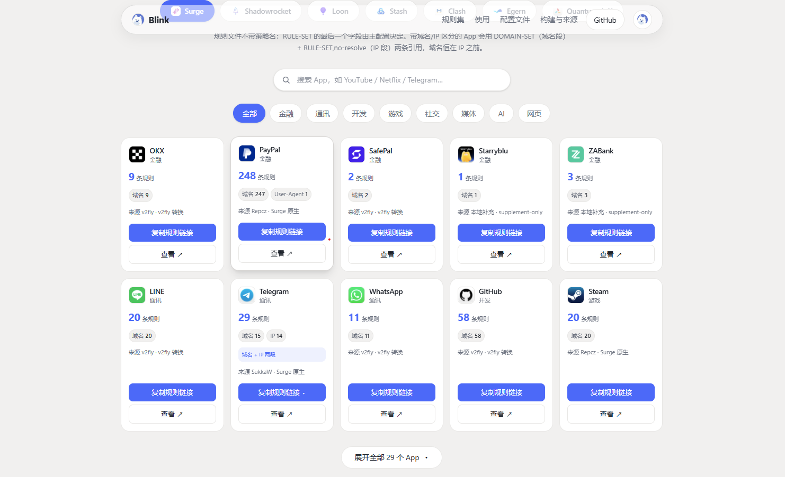

<div align="center">

#  Blink

**多客户端规则与配置 · 自动构建 · 稳定分发**

[](https://github.com/wendy1a1a/Blink/actions/workflows/update.yml)
[](https://github.com/wendy1a1a/Blink/stargazers)
[](https://github.com/wendy1a1a/Blink/commits/main)
[](https://wendy1a1a.github.io/Blink/)
[](LICENSE)

</div>

<br>

个人使用的**多客户端规则与配置文件**仓库，分两层：

- **规则层（自动维护）**：把经过审计的上游规则转换为一份 Canonical Rule Model，渲染为 **Surge / Shadowrocket / Loon / Stash / Clash / Egern / Quantumult X** 七种客户端格式，每日更新，不是为每个客户端维护一套独立规则。
- **配置层（人工维护）**：把同一份配置意图（策略组 / 规则引用 / 通用设置）迁移为七客户端**完整配置文件**，单一订阅池组织、占位符已内置，替换一条订阅即可复用。

生成目录由构建器自动维护、绝不手工修改；仓库不含任何订阅 URL、token、密码或证书等敏感信息。

> [!NOTE]
> 配置文件是**人工维护层**，不随规则每日更新；导入前把 `https://YOUR-SUBSCRIPTION-URL` 替换为你的订阅链接，并真机验证策略组与分流效果。

> [!IMPORTANT]
> 本仓库仅供个人学习研究使用；使用前请阅读 [DISCLAIMER.md](DISCLAIMER.md) 与 [THIRD_PARTY_NOTICES.md](THIRD_PARTY_NOTICES.md)。**禁止任何形式的转载或发布至国内平台**。

---

## 目录

- [规则集快速开始](#rules-quickstart)
- [配置文件快速开始](#profiles-quickstart)
- [网页入口](#portal)
- [完整性校验](#integrity)
- [来源政策](#sources)
- [常见问题](#faq)
- [使用与许可](#license)

---

<a id="rules-quickstart"></a>

## 规则集快速开始

| 客户端 | 配置段 | 引用方式 | 分发目录 |
| --- | --- | --- | --- |
| Surge | `[Rule]` | `RULE-SET,<URL>,<策略>` | `Surge/` |
| Shadowrocket | `[Rule]` | `RULE-SET,<URL>,<策略>` | `Shadowrocket/` |
| Loon | `[Remote Rule]` | `URL, policy=<策略>, tag=<App>, enabled=true` | `Loon/` |
| Stash | `rule-providers` + `rules` | `RULE-SET,<App>,<策略>` | `Stash/` |
| Clash（Mihomo） | `rule-providers` + `rules` | `RULE-SET,<App>,<策略>` | `Clash/`（已去 USER-AGENT） |
| Egern | `rules` | `rule_set: {match: <URL>, policy: <策略>}` | `Egern/` |
| Quantumult X | `[filter_remote]` | `URL, tag=<App>, force-policy=<策略>, …` | `QuantumultX/` |

其中 `Surge/`、`Loon/`、`Shadowrocket/`、`Stash/` 四份内容**逐字节相同**，按需取自己客户端的目录即可。以下按客户端给出完整示例。

每个 App 默认提供完整 `.list`；需要 domain-first / IP-last 时另有**语义分段**视图：

- `<App>-domainset.conf` — 纯域名段（`DOMAIN` / `DOMAIN-SUFFIX`，**不触发 DNS**）；
- `<App>-nonip.conf` — 非 IP 段（含 `DOMAIN-KEYWORD` / `USER-AGENT` / `PROCESS-NAME`，**不触发 DNS**）；
- `<App>-ip.conf` — IP 段（`IP-CIDR` / `IP-CIDR6`，**触发 DNS**，需置于规则末尾）。

> **设计理念**：规则类型即 DNS 语义 —— `domainset` / `non_ip` 段命中时不触发本地解析，只有走到
> `ip` 段（或 `FINAL` / direct）才解析域名；因此所有域名段必须置于所有 IP 段**之前，没有例外**
> （domain-first / IP-last），否则待代理域名会被本地提前解析，失去 DNS 防污染保护。
> 这个分类与不变式借鉴自 [SukkaW / Surge](https://github.com/SukkaW/Surge) 及其博客：
> [I have my unique Surge setup](https://blog.skk.moe/post/i-have-my-unique-surge-setup/) ·
> [DNS 泄漏、CDN 访问优化与 Fake IP](https://blog.skk.moe/post/lets-talk-about-dns-cdn-fake-ip/) ·
> [生活在字典树上](https://blog.skk.moe/post/how-to-store-way-too-many-domains-and-ips-101/)。

> [!WARNING]
> **复制前必读：文件后缀名就是引用方式的答案，写反了会"静默失效"**
>
> | 你要引用的文件 | 正确写法（Surge / Shadowrocket） |
> | --- | --- |
> | `<App>-domainset.conf`（内容为 `.example.com` 这类裸域名清单） | `DOMAIN-SET,<URL>,<策略>,extended-matching` |
> | `<App>-nonip.conf`（内容为 `DOMAIN,` / `DOMAIN-SUFFIX,` 等完整规则行） | `RULE-SET,<URL>,<策略>` |
> | `<App>-ip.conf`（内容为 `IP-CIDR,` / `IP-CIDR6,` 规则行） | `RULE-SET,<URL>,<策略>,no-resolve` |
>
> 引用方式写反后 Surge **不会报错**，只是该规则集不生效、流量悄悄落到 `FINAL`——如果发现分流没有按预期走，请先检查这一项。
> 一句话口诀：**`-domainset.conf` 配 `DOMAIN-SET`，`-nonip.conf` / `-ip.conf` 配 `RULE-SET`，IP 段记得加 `no-resolve`**。
> 最省事的方式是直接复制门户给出的接入片段，不要自行改写类型。

规则文件**不带策略名**，policy 由引用处指定。各客户端引用写法如下。

### Surge / Shadowrocket

在 `[Rule]` 段、`FINAL` 之前加一行：

```ini
RULE-SET,https://raw.githubusercontent.com/wendy1a1a/Blink/main/Surge/<App>.list,<你的策略>
```

Shadowrocket 语法与 Surge 相同，也可直接用 `Shadowrocket/` 目录 URL。

### Loon

在 `[Remote Rule]` 段添加一行：

```ini
https://raw.githubusercontent.com/wendy1a1a/Blink/main/Loon/<App>.list, policy=<你的策略>, tag=<App>, enabled=true
```

### Stash

在 `rule-providers` 注册 classical text 规则集，在 `rules` 里用 `RULE-SET` 引用：

```yaml
rule-providers:
  <App>:
    type: http
    behavior: classical
    format: text
    url: https://raw.githubusercontent.com/wendy1a1a/Blink/main/Stash/<App>.list
    interval: 86400
rules:
  - RULE-SET,<App>,<你的策略>
```

### Clash（Android）

Mihomo 内核通用（Clash Meta for Android / FLClash）。在 `rule-providers` 注册 classical text 规则集，在 `rules` 里用 `RULE-SET` 引用；Blink 规则经 `Clash/` 目录分发（USER-AGENT 已由构建器显式去除并计数）：

```yaml
rule-providers:
  <App>:
    type: http
    behavior: classical
    format: text
    url: https://raw.githubusercontent.com/wendy1a1a/Blink/main/Clash/<App>.list
    interval: 86400
rules:
  - RULE-SET,<App>,<你的策略>
```

### Egern

```yaml
rules:
  - rule_set:
      match: https://raw.githubusercontent.com/wendy1a1a/Blink/main/Egern/<App>.yaml
      policy: <你的策略>
```

（Egern 也可以直接用 `rule_set.match` 消费 `Surge/` 目录的 classical `.list` URL。）

### Quantumult X

在 `[filter_remote]` 段添加一行；行尾的 `policy` 是占位符，实际策略由 `force-policy` 指定：

```ini
https://raw.githubusercontent.com/wendy1a1a/Blink/main/QuantumultX/<App>.list, tag=<App>, force-policy=<你的策略>, update-interval=172800, opt-parser=false, enabled=true
```

<sub>raw 直连不稳时，可改用 jsDelivr 加速地址（缓存最长 12 小时，规则更新会相应延迟）：`https://cdn.jsdelivr.net/gh/wendy1a1a/Blink@main/Surge/<App>.list`（其余客户端同理替换目录，如 `Clash/`、`QuantumultX/`）。</sub>

---

<a id="profiles-quickstart"></a>

## 配置文件快速开始

七客户端**完整配置文件**位于 [`Profiles/`](Profiles/)：`Surge.conf`、`Shadowrocket.conf`、`Loon.conf`、`Stash.yaml`、`Clash.yaml`（Android）、`Egern.yaml`、`QuantumultX.conf`。

1. 下载对应客户端的配置文件（或在[门户](https://wendy1a1a.github.io/Blink/)「配置文件」板块用 **iOS 一键导入**）。
2. 用文本编辑器把 `https://YOUR-SUBSCRIPTION-URL` 替换成你的订阅链接。
3. 导入客户端，真机验证策略组与分流效果。

配置采用**单一订阅池**组织：全部策略组与地区筛选只依赖一条订阅；规则全部通过远程 URL 引用（本仓库规则 + 成熟上游基础设施），不复制规则内容。配置文件**人工维护、人工审核后发布**，不随规则每日更新。

---

<a id="portal"></a>

## 网页入口

无需域名即可访问：[`https://wendy1a1a.github.io/Blink/`](https://wendy1a1a.github.io/Blink/)，页面板块：

- **规则集**：切换七客户端标签查看每个 App 的规则数与接入方式，一键复制；
- **接入你的客户端**：七客户端全量接入片段，一键复制；
- **配置文件**：七客户端配置文件的下载 / 复制 / **iOS 一键导入**（支持 URL Scheme 的客户端；Clash 为 Android，手动导入）与导入指引；
- **构建与来源**：构建管线与选源原则。

<div align="center">
  <a href="https://wendy1a1a.github.io/Blink/">
    
  </a>
</div>

---

<a id="integrity"></a>

## 完整性校验

根目录 [`manifest.json`](manifest.json) 为 30 个 App、七客户端共 210 个生成产物记录 SHA256、上游内容指纹、canonical 规则指纹和显式降级统计。push / PR 与每日更新会自动执行七端等价性、重复/空集/排序、语义视图一致性、跨 App overlap、Profile 引用及敏感模式门禁；完整命令与设计边界见 [`engine/docs/MACHINE_GATES.md`](engine/docs/MACHINE_GATES.md)。

---

<a id="sources"></a>

## 来源政策

- 每个 App 独立审计选源：以更新活跃度、覆盖、范围、格式与维护质量为证据，作者偏好只在候选规范化后等价时作 tie-breaker（顺序：SukkaW > Repcz > 其他长期验证的成熟作者）；每 App 恰好 1 个 primary、至多 1 个 supplemental。完整的候选、证据与结论档案见 [`engine/SOURCE_AUDITS.md`](engine/SOURCE_AUDITS.md)。
- Reject / Domestic / China IP / CDN / LAN 等基础设施**不复制进本仓库**，继续直接引用成熟上游。

---

<a id="faq"></a>

## 常见问题

**这是什么？**

一份 canonical 规则自动渲染成七种客户端格式的规则集；另有人工维护的完整配置文件（`Profiles/`）。不是代理客户端，不负责你的策略。

**为什么规则文件里没有策略名？**

策略由引用处指定（`RULE-SET,URL,policy` / Loon `policy=` / Egern `rule_set.policy` / QX `force-policy`），规则集只描述"命中什么"。QX 行尾 `policy` 是占位符。

**为什么我的客户端比其他端少几条规则？**

显式降级，不是缺漏：Egern / Quantumult X 丢弃 `PROCESS-NAME`，Clash 丢弃 `USER-AGENT`（内核无此类型），数量见门户卡片与构建报告。

**规则多久更新？**

每日自动更新（约 00:01，北京时间），有变化才提交。刷新节奏由引用行的 `interval` 决定：Stash / Clash 1 天、Quantumult X 2 天、其余由 App 自动更新。

**出问题了，怎么反馈？**

先自检：① 策略与顺序；② 目标是否属基建类（Reject / Domestic / CDN / China IP / LAN，有意不收录）。确属漏网请附：客户端 + 日志确认的域名 + 与上游比较结果（或直接按 [规则反馈模板](.github/ISSUE_TEMPLATE/rule-feedback.md) 提交）。个人仓库无响应承诺——带证据的反馈最快修复。

**我能参与维护吗？**

规则由作者本人维护，修改权不在别处——建议与反馈永远欢迎。若你提交 Pull Request，被我看到的话我会 Review——是否采纳、何时响应，由我决定。

---

<a id="license"></a>

## 使用与许可

感谢 Repcz、SukkaW、blackmatrix7、v2fly 等上游作者对规则集的长期维护（各 App 的来源明细与许可见 [THIRD_PARTY_NOTICES.md](THIRD_PARTY_NOTICES.md)）。

本仓库为个人规则分发与学习维护而设，无任何担保；请结合自己的代理客户端策略与日志自行验证，并遵守适用法律、服务条款与上游许可。**原创部分（构建代码、测试、工作流、门户源码与文档）以 [MIT License](LICENSE) 授权**；`Surge/`、`Loon/`、`Shadowrocket/`、`Stash/`、`Clash/`、`Egern/`、`QuantumultX/` 与 `Profiles/` 等生成产物**不在 MIT 覆盖范围内**，逐文件遵循 [THIRD_PARTY_NOTICES.md](THIRD_PARTY_NOTICES.md) 记载的上游许可。

> [!WARNING]
> 任何以任何方式查看此项目的人或直接或间接使用该项目的使用者都应仔细阅读此声明。
>
> 保留随时更改或补充此免责声明的权利。
>
> 一旦使用并复制了该项目的任何文件，则视为您已接受此免责声明。
